# 1、快速入门

<h2>1.1引入Javascript</h2>

1、内部标签

```
<script>
	alert('hello,world');//alert打印输出
</script>
```

2、外部引入

```
<script src="js文件路径"></script>
```


## 1.2基本语法入门
```javascript
<script>
    // 1、定义变量   变量类型    变量名 = 变量值;
    var score = 77;
    // alert(num);
    //2、条件控制
    if (score > 60 && score < 70){
    alert("60-70");
}else if (score > 70 && score < 80){
    alert("70-80");
}else {
    alert("other");
}
    // alert(score) 再浏览器弹窗打印变量  相当于C的println();
    //
</script>
```
浏览器调试常用
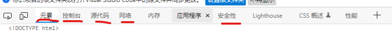

## 1.3数据类型
数值，文本，图形……

number

在JS中所有的数值都是Number类型 包括整数浮点数

JS中可以表示最大的数字最大值

```javascript
Number.MAX_VALUE    //1.7976931348623157e+308
//超出最大值的范围会返回一个Infinity的值表示无穷大

```

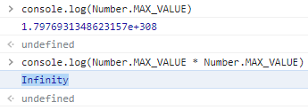

js不区分小数和整数，Number
```javascript
123     //整数
123.1   //浮点数
1.123e3 //科学计数法
-99     //负数
NaN     //not a number
Infinty //表示无限大
```

在JS中整数的运算基本可以保证准确，如果使用JS进行浮点数运算，可能得到一个不精确的结果


字符串

'abc' "abc"

布尔值

turn,false

null（空值）    专门用来表示一个为空的对象

undefined（未定义）   声明一个变量，但并不给变量赋值时，它的值就是undefined

> 逻辑运算

```javascript
&&  与  两个都为真结果为真
           js中的与属于短路与，前面的布尔值为false就不会检查后面的值

||  或  一个为真结果为真
        短路或，前面的值为true就不会检查后面的值

!   取反  如果对非布尔值进行运算，则会将其转换为布尔值，然后再取反
```

&&  ||  非布尔值运算

```javascript
/*
对于非布尔值进行与或运算时
    会先将其转换为布尔值，然后再运算，并且返回原值

与运算
    如果第一个值为true，则必然返回第二个值
    如果第一个值为false，则直接返回第一个值

或运算
    如果第一个值为true，则必然返回第一个值
    如果第一个值为false，则直接返回第二个值
 */
```

>比较运算符

```javascript
=   赋值
    
==  等于（类型不一样，值一样会判断为turn）

!=  不相等 （用来判断两个值是否不相等，如果不相等返回true，反之返回false）

=== 绝对等于（类型一样，值一样结果为turn）
    不会自动类型转换

!== 不全等 （类型不一样，值不一样结果为turn）
    不会自动类型转换
```
NaN===NaN   这个与所有数值都不相等，包括自己

只能通过isNaN(NaN)来判断是否是NaN

>关系运算符

```javascript
/*
>   大于号
>=  大于等于
<   小于
<=  小于等于

非数值的情况
    非数值进行比较时，会将其转换为数字然后再比较
    如果符号两侧的值都是字符串，不会将其转换为数字进行比较而会分别比较字符串中的Unicode编码
 */
```

>条件运算符

```javascript
/*
语法：
    条件表达式?语句1:语句2;
执行流程
    条件运算符在执行时，首先对条件表达式进行求值，
        如果为true，则执行语句1，并返回执行结果 
        如果为false，则执行语句2，并返回执行结果
 */

var a = 20, b = 30;

var max = a > b ? a : b;

console.log(max);

```

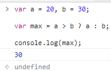

## 1.4严格审查模式
```javascript
<script>
        'use strict'// 严格审查模式，预发JS的随意性产生的问题
        let i = 1;  //let局部变量
        
</script>
```

# 2、数据类型

## 2.1、字符串

1、正常的字符串使用单引号或者双引号包裹

2、转义字符

```javascript
\'  
\n      换行
\t      tab
\u###   Unicode字符
\x###   ascll字符
```

3.多行字符串编写

```javascript
var msg = `hello
    nihao
jjjjj`;
```

4.模板字符串

```javascript
let name ="一一";
let age = 3;
let msg = `hello,${name}`
```

5.字符串长度
```javascript
console.log(student.length)
```

6.字符串的可变性，不可变

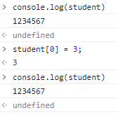

### 强制类型转换

-指将一个数据类型强制转换为其他的数据类型
-类型转换主要指，将其他数据类型转换为：String Number Boolean

> 将其他数据类型转换为string 

**方法一**：调用被转换数据的toString()方法

```javascript
//该方法不会影响原变量，它会将转换的结果返回
//注意：null和undefined这两个值没有toString(),调用会报错
var a = 123;
a.toString();
```
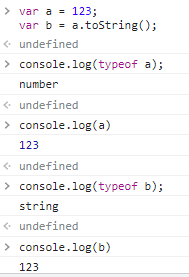

**方法二**：调用String()函数，并将被转换的数据作为参数传递给函数

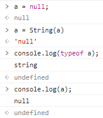

> 将其他数据转换为Number

**方式一**：使用Number()函数

字符串--->数字

1、纯数字字符串，直接转换为数字

2、字符串中有非数字内容，则转换NaN

3、如果字符串是一个空串或者是一个空的字符串，则转换为0

布尔值--->数字

true 1

false 0

Null--->数字 0

undefin--->数字 0

```javascript
var a = "123";

a = Number(a);

console.log(typeof a);
console.log(a);
```

**方式二**：

parseInt()  把一个字符串转换为一个整数

```javascript
var a;
//调用parseInt()函数将a转换为number
//parseInt()可以将一个字符串中的有效整数内容取出来，然后转换为number
a = "123px";
a = parseInt(a);

console.log(typeof a);
console.log(a);
```

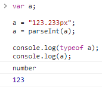

> parseFloat  把一个字符串转换为一个浮点数

```javascript
var a;
//调用parseFloat()函数将a转换为number
//parseFloat()可以将一个字符串中的有效浮点数内容取出来
a = "123.34.333px";
a = parseFloat(a);

console.log(typeof a);
console.log(a);
```

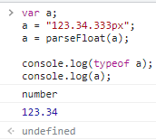

> 其他进制数字

```javascript
//十六进制 0x开头
a = 0x10;

//八进制 0开头
a = 070;

//二进制 0b开头 部分浏览器支持
a = 0b10;
```

部分浏览器会把"070",当作八进制或者十进制解析，可在parseInt()中添加第二个参数指定进制

```javascript
var a;
a = "070";
a = parseInt(a);
console.log(typeof a);
console.log(a);
```

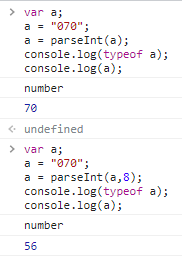

> 将其他数据类型转换为Boolean

```javascript
/*
使用Boolean()函数
数字--->布尔
    除了0和NuN，其余都是true
    
字符串--->布尔
    除了空串，其余都是true
    
null和undefined都会转换为false

对象也会转换为true
 */
```

## 运算符

> 一元运算符

```javascript
/*
+正号
    正号不会对数字产生如何影响

-负号
    负号可以对数字进行取反

对于非number类型的值
    会先转换为number，然后在运算
    可以对一个其他的数据类型使用+，来将其转换为number
*/
```

> 自增和自减

```javascript
/*
自增++
    通过自增可以使变量在自身的基础上加一
    对于一个变量自增以后，原变量的值会立即自增1
    自增分成两种：后++(a++)和前++(++a)
        不同的是a++和++a的值
    a++的值等于原变量的值
    ++a的值等于原变量自增后的
*/

var a = 1;

//console.log(a++); //1
console.log(++a);   //2

console.log("a = "+a);
```

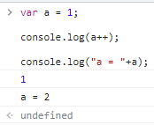 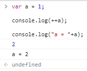


7.大小写转换
```javascript
//方法
student.toUpperCase()
student.toLowerCase()
```

8.student.indexOf("t")获取字符下标

9.substring
```javascript
[)
student.substring(1)//从第一个字符截取到最后一个字符
student.substring(1,3)//[1,3)
```

## 2.2数组

Array可以包含任意的数据类型

```javascript
var arr = [1,2,3,4,5,6]
arr[0]  //取值
arr[0] = 1  //给数组内第1位赋值
```

1.长度

```javascript
arr.length
```

2.indexOf,通过元素获取下标索引
```javascript
arr.indexOf(a)
0
```
字符串的"1"和数字1是不同的

3.slice()截取数组的一部分，返回一个新数组，类似string中的substring

4.尾部push(),pop()

```javascript
push()  再数组尾部压入新内容
pop()   弹出数组尾部的一个元素
```

5.头部unshift(),shift()

```javascript
unshift()   在数组的头部压入新元素
shift()     弹出头部一个元素
```

6.排序sort()
```javascript
(8) ['b', 1, 2, 3, 4, '1', '2', 'a']
arr.sort()
(8) [1, '1', 2, '2', 3, 4, 'a', 'b']
```

7.元素反转reverse()

```javascript
(8)[1, '1', 2, '2', 3, 4, 'a', 'b']
arr.reverse()
(8)['b', 'a', 4, 3, '2', 2, '1', 1]
```

8.concat()

concat()并没有修改原来的数组，只是返回了一个新的数组

```javascript
(8)['b', 'a', 4, 3, '2', 2, '1', 1]
arr.concat([7,8,9])
(11)['b', 'a', 4, 3, '2', 2, '1', 1, 7, 8, 9]0: "b"1: "a"2: 43: 34: "2"5: 26: "1"7: 18: 79: 810: 9length: 11[[Prototype]] : Array(0)
arr
(8)['b', 'a', 4, 3, '2', 2, '1', 1]
```

9.连接符join

打印拼接数组，使用特点的字符连接

```javascript
['b', 'a', 4, 3, '2', 2, '1', 1]
arr.join('-')
'b-a-4-3-2-2-1-1'
```

10.多维数组

```javascript
arr = [[1,2],[3,4],["5","6"]]
arr[1][1]
4
```

数组：存储数据

## 2.3对象

对象属于一种复合的数据类型，在对象中可以报错多个不同数据类型的属性

>对象的分类

1.内建对象

- 由ES标准中定义的对象，在任何的ES的实现中都可以使用
- 比如：Math String Number Boolean Function Object......

2.宿主对象

- 由JS的运行环境提供的对象，目前来讲主要指由浏览器提供的对象
- 比如：DOM BOM

3.自定义对象

- 由开发者自己创建的对象

```javascript
//创建对象
/*
使用new关键字调用的函数，是构造函数constrctor
    构造函数是专门用来创建对象的函数
使用typeof检查一个对象时，会返回object
 */
var obj = new Object();

/*
在对象中保存的值称为属性
向对象添加属性
语法：
    对象.属性名 = 属性值;
 */

//向obj添加一个name属性
obj.name = "孙悟空";
//向obj添加gender属性
obj.gender = "男";
//向obj添加age属性
obj.age = 18;

/*
读取对象中的属性
语法：
    对象.属性名
读取对象中没有的属性，不会报错而是会返回undefined
 */

//console.log(obj.name);

/*
修改对象的属性值
语法：
    对象.属性名 = 新值;
 */

obj.name = "tom";

/*
删除对象的属性
语法：
    delete 对象.属性名;
 */

delete obj.name;

console.log(obj.name);//undefined
```

属性名

```javascript
var obj = new Object();
/*
向对象中添加属性
属性名：
    - 对象的属性名不强制要求遵守标识符规范
 */

obj.name = "孙悟空";
obj.var = "jj";

/*
使用特殊属性名
语法：
    对象["属性名"] = 属性值;
读取：
    对象["属性名"]
在[]中可以传递一个变量
 */
obj["123"] = 456;
obj["haihai"] = "jjjji";
var n = "123"

console.log(obj[n]);//456
```

属性值

```javascript
/*
属性值
    JS对象的属性值，可以是任意的数据类型，甚至可以是一个对象
 */
obj.test = true;

//创建一个对象
var obj2 = new Object();
obj2.name = "杰哥";

obj.test = obj2;

console.log(obj.test.name);
```

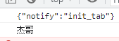

in运算符

```javascript
/*
in 运算符
    -通过该运算符可以检查一个对象中是否含有指定的属性
        有返回true，没有返回false
    - 语法
        "属性名" in 对象
 */
console.log("test2" in obj);//false
```

基本和引用数据类型

```javascript
/*
基本数类型
    String Number Boolean Null Undefined

引用数据类型
    Object

JS中的变量都是保存到栈内存中的
    基本数据类型的值直接在栈内存中存储
    值与值之间是独立存在，修改一个变量不会影响其他的变量
    
对象是保存栈内存中的，每创建一个新的对象，就会在堆内存中开辟一个新空间，
而变量保存的是对象的内存地址（对象的引用），如果两个变量保存的是同一个对象引用
当一个通过一个变量修改属性时，另一个也会受到影响
 */

var a = 123;
var b = a;
a++;

console.log("a = " + a);//124
console.log("b = " + b);//123

var obj = new Object();
obj.name = "杰哥";
var obj2 = obj;
obj.name = "阿伟";

console.log(obj.name);  //阿伟
console.log(obj2.name); //阿伟

var obj3 = new Object();
var obj4 = new Object();

obj3.name = "杰哥";
obj4.name = "杰哥";

/*
当比较量基本数据类型时，是比较值
而比较两个引用数据类型时，它是比较对象的内存地址
    即使两个对象内容一模一样，都是地址不同，也会返回false
 */
console.log(obj3 == obj4);  //false
```

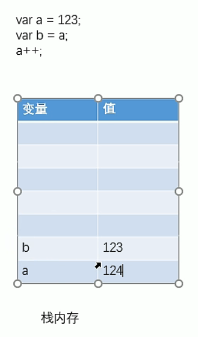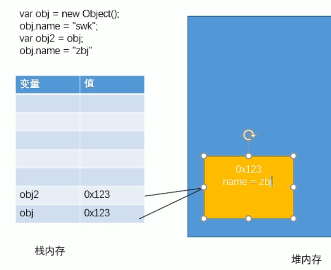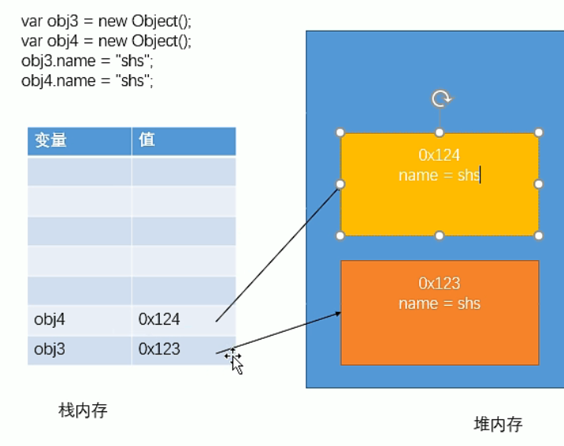

## 2.4流程控制 

if判断语句

```javascript
var age = 3;
if (age > 1){
    alert("haha");
}else if (age > 5){
    alert("heiheihei");
}else {
    alert("kua~")
}
```

prompt()函数

可以弹出一个提示框，该提示框会带有一个文本框

用户输入的内容将会作为函数的返回值，可以定义一个变量来接收

条件分支语句switch

```javascript
/*
语法：
    switch(条件表达式){
        case 表达式:
            语句...
            break;
        case 表达式:
            语句...
            break;
        default:
            语句...
            break;
    }
 */
```

while循环 尽量避免死循环代码

```javascript
var age = 3;
while (age < 100){
    age++;
    console.log(age);
}

//dowhile
do{
    age++;
    console.log(age);
}while(age < 100)
```

for循环

```javascript
for (let i = 0; i < 100; i++) {
    console.log(i);
}
```

> break和continue

```javascript
/*
break关键字可以用来退出循环语句，会终止离它最近的循环语句
 */

for (var i=0; i<5; i++){
    console.log("外" + i);
    for(var j=0; j<1; j++){
        break;
        console.log("内" + j);
    }
}
```

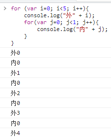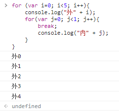

```javascript
/*
可以为循环语句创建一个label，来标识当前的循环
label:循环语句
使用break语句时，可以在break后跟着一个label
 */

outer:
for (var i=0; i<5; i++){
    console.log("外" + i);
    for(var j=0; j<1; j++){
        break outer;
        console.log("内" + j);
    }
}
```

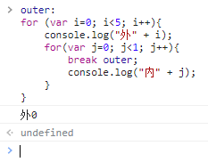

```javascript
/*
continue关键字可以用来跳过当次循环
    默认终止最近的循环体
 */
for (var i = 0; i < 5; i++) {
    if (i == 2){
        continue;
    }
    console.log(i);
}
```

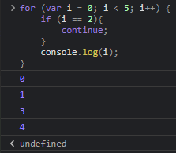

计时器

```javascript
/*
console.time("计时器名字")
需要一个字符串作为参数，这个字符串将会作为计时器的标识
 */

console.time("test");//开启计时器
for (var i = 0; i < 5; i++) {
    if (i == 2){
        continue;
    }
    console.log(i);
}
console.timeEnd("test");//终止计时器
```

foEach循环

```javascript
var age = [12,3,12,4,12,5,31,45,21];
//函数
age.forEach(function (value){
    console.log(value)
})
```

for...in

```javascript
var age = [12,3,12,4,12,5,31,45,21];
//for(var index in object){}
for (var num in age) {
    if (age.hasOwnProperty(num)){
        console.log(age[num])
    }
}
```

## Map和Set

ES6的新特性

Map

```javascript
var map = new Map([['tom',100],['jack',90],['haha',80]]);
var name = map.get('tom');  //通过key获得value
map.set('admin',1145141919810); //增加或修改
map.delet("tom");   //删除
```

Set

```javascript
var set = new Set([3,1,1,1,1]); //set可以去重
set.add(2); //添加
set.delete(1);  //删除
console.log(set.has(3));    //是否包含某个元素
```

## 2.6iterator

遍历下标

```javascript
var arr = [3,4,5]
for (let x in arr) {
    console.log(x)
}
```

遍历数组

```javascript
var arr = [3,4,5]
for (let x of arr) {
    console.log(x)
}
```

遍历map

```javascript
var map = new Map([['tom',100],['jack',90],['haha',80]]);
for(let x of map){
    console.log(x)
}
```

遍历set

```javascript
var set = new set([5,6,7]);
for (let x of set){
    console.log()
}
```

# 3函数

## 3.1定义函数
函数 function
- 函数也是一个对象
- 函数可以封装一些功能（代码），在需要时可以执行这些功能（代码）
- 函数中可以保存一些代码在需要的时候调用
- 使用typeof检查一个函数对象时，会返回function

```javascript
/*不好用
//创建一个函数对象
//可以将要封装的代码一字符串的形式传递给构造函数
var fun = new Function("console.log('杰哥不要')");

//封装的函数不会立即执行，函数中的代码会在函数调用的时候执行
//调用函数语法：函数对象()
fun();
*/

/*
使用函数声明 来创建一个函数
语法：
    function 函数名([形参1,形参2...形参N]){
        语句...
    }
 */
function fun2() {
    console.log("开玩笑，我超勇的好吗");
}
//console.log(fun2);
fun2();

/*
使用函数表达式来创建一个匿名函数
var 函数名 = function([形参1,形参2...形参N]){
    语句...
}
 */
var fun3 = function (){
    console.log("听话，让我看看");
}

fun3();
```

## 3.2函数的参数
定义一个用来求两个数的函数
- 可以在函数的()中来指定一个或多个形参(形式参数)
- 多个形参之间使用,隔开，声明形参相当于在函数内部声明了对应的变量
- 但是并不赋值

```javascript
function sum(a,b){
    alert(a + b);
}

/*
在调用函数时，可以在()中指定实参（实际参数）
    实参将会赋值给函数中对应的形参
 */
//sum(1,2);
/*
调用函数时解析器不会检查实参的类型
函数的实参可以是任意的数据类型
*/
// sum(123,"he");
// sum(true,false);

/*
调用函数时，解析器不会检查实参数量
    多余实参不会被赋值
如果实参的数量少于形参的数量，则没有对应的形参将是undefined
 */
sum(123,456,"hai",true,false);
sum(1);
```

## 3.3函数的返回值

```javascript
/*
可以使用return来设置函数的返回值
语法:
    return 值;

return后的值将辉作为函数的执行结果返回
    可以定义一个变量来接收该结果

在函数中return后面的语句都不会执行

return 语句后不跟任何值就相当于返回一个undefined
不写return，则也会返回undefined

return可以返回任何值

*/
function sum(a,b,c){
    var d = a + b + c;
    return d;
    //alert("he");//
}

//调用函数
//变量result的值就是函数的执行结果

var result = sum(4,5,6);

alert(result);
```

实参可以是任意数据类型，也可以是一个对象
- 当参数过多时，可以将参数封装到一个对象中，然后通过对象传递

```javascript
//定义一个函数判断数字奇偶数
function isOu(num) {
    return num % 2 == 0;
}
var result = isOu(15);
/*if (result){
    alert("偶数")
}else {
    alert("奇数")
}*/

function mianJi(r) {
    return 3.14 * r * r;
}
result = mianJi(10);
console.log(result);

function sayHello(o){
    console.log("我是"+o.name+",今年"+o.age+"了，来自"+o.address);
}
var obj = {
    name : "杰哥",
    age : 28,
    address : "台湾省"
}
//sayHello(obj);

//实参可以是一个对象，也可以是一个函数
function fun(a){
    console.log(a)
    // a(obj);
}
// fun(sayHello)

fun(mianJi(10));
/*
mianJi()
    - 调用函数
    - 相当于使用函数的返回值

mianJi
    - 函数对象
    - 相当于直接使用函数对象
 */
```

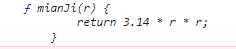 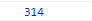

立即执行函数

- 函数定义完，立即被调用，这种函数叫做立即执行函数
- 往往只执行一次

```javascript
/*(function (){
    alert("jiegbuyao");
})();*/

(function (a, b) {
    console.log(a);
    console.log(b);
})(123,456)
```

> 方法

```javascript
var obj = new Object();

obj.name = "杰哥";
obj.age = 22;

//对象属性值可以是任何的数据类型，也可以是个函数
obj.sayName = function (){
    console.log(obj.name);
};
//console.log(obj.sayName());

function fun(){
    console.log(obj.name);
}

// 调方法
obj.sayName();

// 调函数
// fun();

/*
函数可以称为对象的属性
    如果一个函数作为一个对象的属性保存
    那么我们称中国函数是这个对象的方法
    调用这个函数就说调用函数的方法（method）

但是它只是名称上的区别没有其他区别
 */
var obj2 = {
    name : "阿伟",
    age : 18,
    sayName : function (){
        console.log(obj2.name);
    }
};

obj2.sayName();
```

> 枚举对象中的属性

```javascript
var obj = {
    name:"杰哥",
    age:22,
    gender:"男",
    address:"台北"
};
//枚举对象中的属性
//使用for……in 语句
/*
语法：
    for（var 变量 in 对象){}

for...in语句对象有几个属性，循环就会执行几次
    每次执行时会将对象中的一个属性的名字赋值给变量

 */
for (var objKey in obj) {
    console.log("属性 :" + objKey + " : " + obj[objKey]);
}
```

# 作用域

作用域指一个变 量的作用范围

在JS中一共有两种作用域

  1.全局作用域

  - 直接编写在script标签中的JS代码，都在全局作用域
  - 全局作用域在页面打开时创建，在页面关闭时销毁
  - 在全局作用域中有一个对象window，可以直接使用
    - 它代表的是一个浏览器窗口，
  - 在全局作用域中
    - 创建的变量都会作为window对象的属性保存
    - 创建的函数都会作为window对象的方法保存
  - 全局作用域中的变量都是全局变量
    - 在页面任意的部分都可以访问到

```javascript
var a = 10, b = 20/*,c = "hello"*/;
// console.log(window.b);

function fun(){
    console.log("杰哥不要");
}
// window.fun();

// window.alert("听话让我看看");
```

声明变量提前

- 使用var关键字声明的变量，会在所有的代码执行之前被声明（不会提前赋值）
  - 但是如果声明变量时不使用var关键字，则变量不会被声明提前

```javascript
console.log(a);

var a = 10; // undefined
a = 10; // Uncaught TypeError: fun2 is not a function
```

函数的声明提前

- 使用函数声明形式创建的函数 function 函数(){}
  - 他会在所有代码执行之前被创建，可以在声明前被调用

```javascript
fun();
//函数声明，会被提前创建
function fun() {
    console.log("fun");
}
```

- 使用函数表达式创建的函数，不会被声明提前，所以不能在声明提前调用

```javascript
//fun2(); //Uncaught TypeError: fun2 is not a function
//函数表达式，不会被提前创建
var fun2 = function (){
    console.log("fun2")
}
fun2();
```

